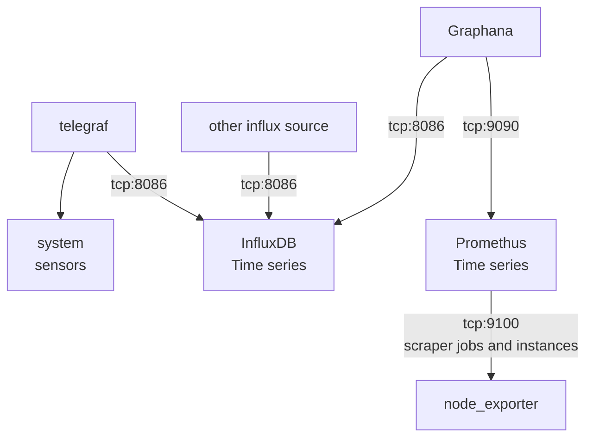

# Overview


# keithmarston.me.uk domain

On homepi you will find the wild card cert:
   /etc/letsencrypt/live/keithmarston.me.uk/fullchain.pem
   Your key file has been saved at:
   /etc/letsencrypt/live/keithmarston.me.uk/privkey.pem
   
To see the timer is setup to renew  
```bash
systemctl list-timers
```

The DNS-01 challenge is handled by the `/root/.aws/config` credentials that are the `cli-pi` aws user.  
* How do we rotate the keys for this???  


Service | Port | user| pass | endpoint | notes
---|---|---|---|---|---
Frontend | https://gpe.keithmarston.me.uk/ |  | 
Graphana | http://gpe.keithmarston.me.uk:3000 | admin | letmein123!
Prometheus DB | https://gpe.keithmarston.me.uk:9090 | promadmin | letmein123! | /metrics | Push data in to DB
Prometheus Node Exporter | http://gpe.keithmarston.me.uk:9100 |  | | /metrics | which one has the metrics?
InfluxDB | http://gpe.keithmarston.me.uk:8086 | admin | letmein123!
InfluxDB | udp:influxdb.kmarston.me.uk:8089 | | | | UDP Metics reciever (Used by ProxMox)
Lokki | http://gpe.keithmarston.me.uk:3100 ||||The user / Graphana end
Lokki | http:9080 |||| The promtail end where we injest gRPC port 9095(Is prometheus already using Promtail???)


# Setup for Graphana and Prometeus

https://www.howtoforge.com/tutorial/monitor-ubuntu-server-with-prometheus/


promadmin:$2y$05$EdXAPnqd5S2ihjZKJCmekOEjz.UNizaMRvKhioz6zglfLQ1ny6pzC 


 Useful to see what promethus is scraping:  
 https://gpe.keithmarston.me.uk:9090/service-discovery?search=




# InfuxDB setup
server side is fairly simple:  
https://linux.how2shout.com/how-to-install-influxdb-on-ubuntu-22-04-to-create-database/ 


http://gpe.keithmarston.me.uk:8086
admin api token:
zaycy9DR150ob16uJOeXTefUaN6oupy1rxPeYA6TW0DZktjJ3iRYD0x6iDnOuQpiJhr3n1JI5zYxr3ijqi2qfw==

